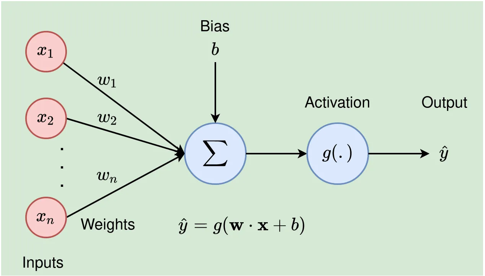
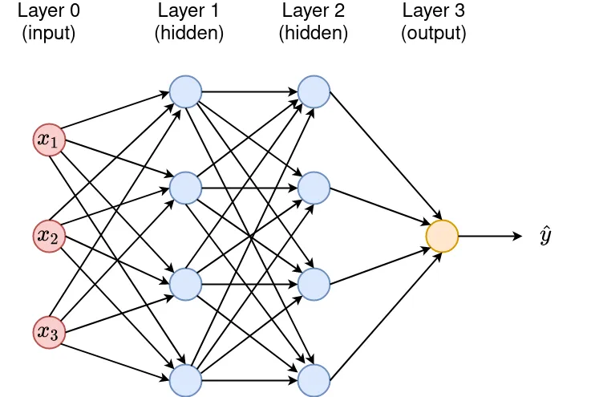

<h1>What are Neural Networks?</h1>
An Artificial Neural Network (ANN) or simply a Neural Network(NN) is interconnected layers of small units called nodes/neurons that perform mathematical operations to detect patterns in data. NN algorithms are built in a way that mimics how human neurons work.

<h5> Key terms</h5>
Before diving deep into neural networks let's get familiar with the basics of neural networks. 
<br>
<br>

1) `Neurons` : Neurons are the basic building blocks/heart of Neural Networks. Each Neuron receives an input , does some mathematical calculations and procudes an output.
2) `Input` : The data passed to the neuron. 
3) `Weights` : A parameter within a DNN that transforms the input data.
4) `Bias` : A constant value added to the sum of the product between input values and respective weights. It is used to accelerate or delay the activation of a given node.
5) `Activation function`: It is a function used to introduce the non-linearity phenomenon into the NN system. This property will allow the network to learn more complex patterns.
6) `Hidden Layers`: Determines how deep the neural network us. Generally more the number of hidden layers more complex relations can be learnt. 

###### Note: Weights and Biases are the trainable parameters that the machine learns during the process of training.

Here's is a simple neural Network with a single neuron



We have a set of defaults weights which combine with the input values and adds a bias term. 

### Neural Networks design
A Neural Network(NN) is made of several neurons stacked into layers. For an n-dimensional input, the first layer (also called the input layer) will have n nodes and the t-dimensional final/output layer will have t neural units. All intermediate layers are called hidden layers, and the number of layers in a network determines the depth of the model. The Figure below shows a 3–4–4–1 NN.



Let's see a simple code in Pytorch to create this Network. 

```python

    import torch
    import torch.nn as nn
    model=nn.Sequential([
        nn.Linear(3,4),
        nn.Linear(4,4),
        nn.Linear(4,1),
    ])
```

#### Connection between Biological and Artificial neuron
There is a fundamental similarity between the neurons in the brain and the artificial neurons that are used in neural networks. Both types of neurons receive inputs from other neurons, process those inputs, and produce an output signal.

In the brain, neurons receive inputs in the form of chemical signals from other neurons, and they produce output signals in the form of electrical impulses that travel along their axons to communicate with other neurons. In contrast, artificial neurons in neural networks receive inputs in the form of numerical values and produce output values through a mathematical operation that combines the inputs with weights and biases.

In both cases, the neurons are connected to each other through synapses or connections, which determine the strength and direction of the signals that are passed between them. In the brain, the strength of synapses can be modulated through a process known as synaptic plasticity, which is thought to underlie learning and memory. In neural networks, the strength of connections is also adjusted during a process known as training, which allows the network to learn from examples and improve its performance on a specific task.

Overall, while there are certainly differences between the neurons in the brain and those in neural networks, there are also clear parallels in terms of their basic structure and function.

